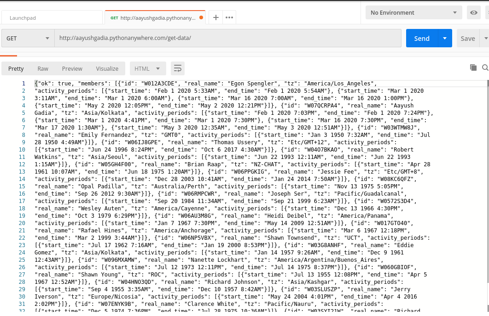
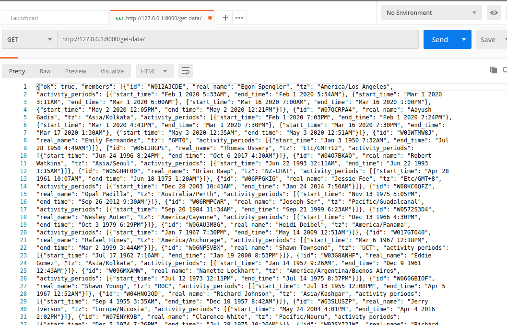

### [README- get_data](https://github.com/gadia-aayush/AayushGadia_Submission/tree/master/aayushassign/get_data)

#### Description-
- It is a **GET API**.
- Fetches the data in JSON in the [**given format**](rough/TestJSON.json)  
- Here we have 2 models- **User** & **ActivityPeriod**.
  - **User model** has **u_id** (user id, here it is also a primary key), **u_name** (user full name) & **u_tz** (user time zone) as the fields.
  - **ActivityPeriod model** has **u_id** (user id), **start_timestamp** (start timestamp of the activity) & **end_timestamp** (end timestamp of the activity) as the fields.
  - All the fields in both the models are **CharField** with maximum length of **255**.
- The Database Table Name of **User model** is **user**, & **ActivityPeriod model** is **activityperiod**.
- We are using the default **Sqlite database** for storing the data.  
- Also, custom management command has been written to populate the database with dummy data.  [**Click here to view the file.**](https://github.com/gadia-aayush/AayushGadia_Submission/blob/master/aayushassign/get_data/management/commands/populatedata.py)
  - Here we have used the **names** module to generate random full names of the user.
  - Based on the ids given in [**this JSON File**](rough/TestJSON.json), it seems that the id is having length = 9 with first 2 characters as "W0" and the 3rd character as a number b/w 0-9 and each of the remaining 6 characters are either upper case alphabet or number. Using this, we generate random 9 length character viz user id.
   - To generate the random time zones of the user we have used the **pytz** module.
   - To generate the random timestamps of the user we have used the **randomtimestamp** module.  **Basically we are storing the timestamps in our database and timestamps are in utc time, so we are converting that timestamp into the local time by the timezone of the user; it is the local time which we are returning finally.**

---

#### Requirements-
- pytz
- randomtimestamp
- names
- Django==2.1.5   
[Click here to view the Requirements file](requirements.txt)

---

#### API Endpoint-
- http://aayushgadia.pythonanywhere.com/get-data/

---

#### Test Data-
- No data to pass, since **GET API**.

---

#### Output Screenshots-
- **Server :**

- **Local Host :**

- [Click here to view the JSON Output File](rough/aayush_response.json)

---

#### AUTHOR-
- **coded by AAYUSH GADIA** 
- **contact info: gadia.aayush@gmail.com**
